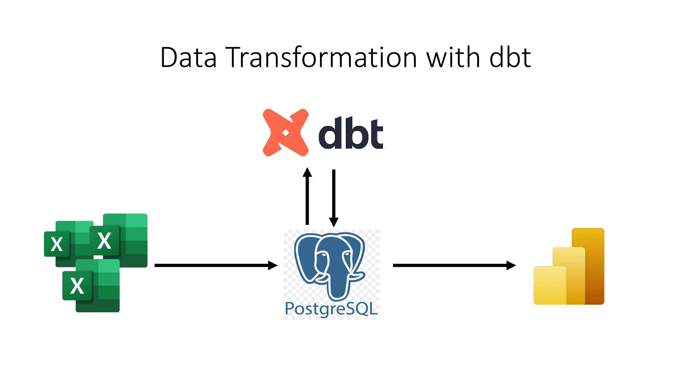
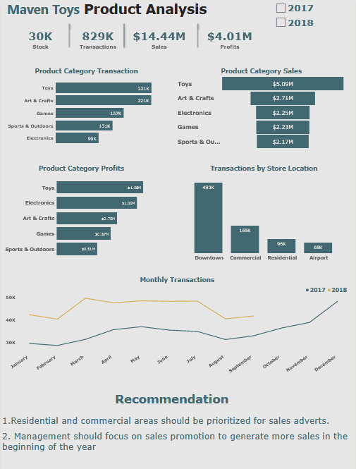

# Maven Toys Dashboard

 

## Sales & inventory data for a fictitious chain of toy stores in Mexico called Maven Toys, including information about products, stores, daily sales transactions, and current inventory levels at each location.

 

  

 

  

 

  

 

## This Power BI Maven Toys Dashboard is the end result of my data transformation with dbt data project, which can be found [here](https://github.com/AviatorIfeanyi/maven_toys_dbt_postgres)

 

## The goal of this project is simply, to learn the usage of a modern data stack tools such as dbt for data transformation, loading the transform data into a postgreSQL data warehouse and finally connecting Power BI to the data warehouse for data visualization.
